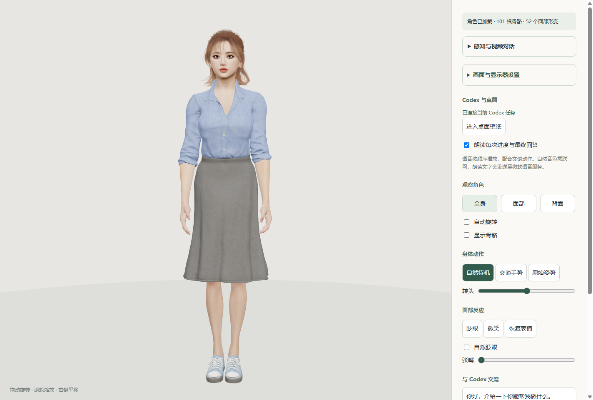
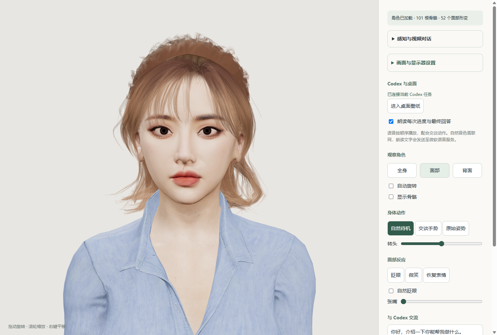
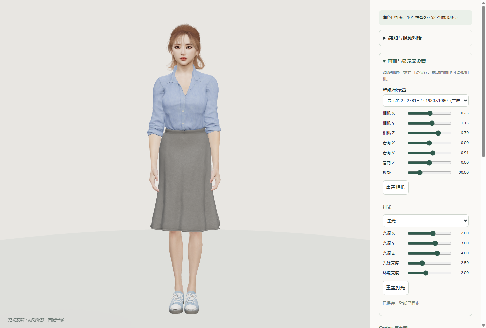
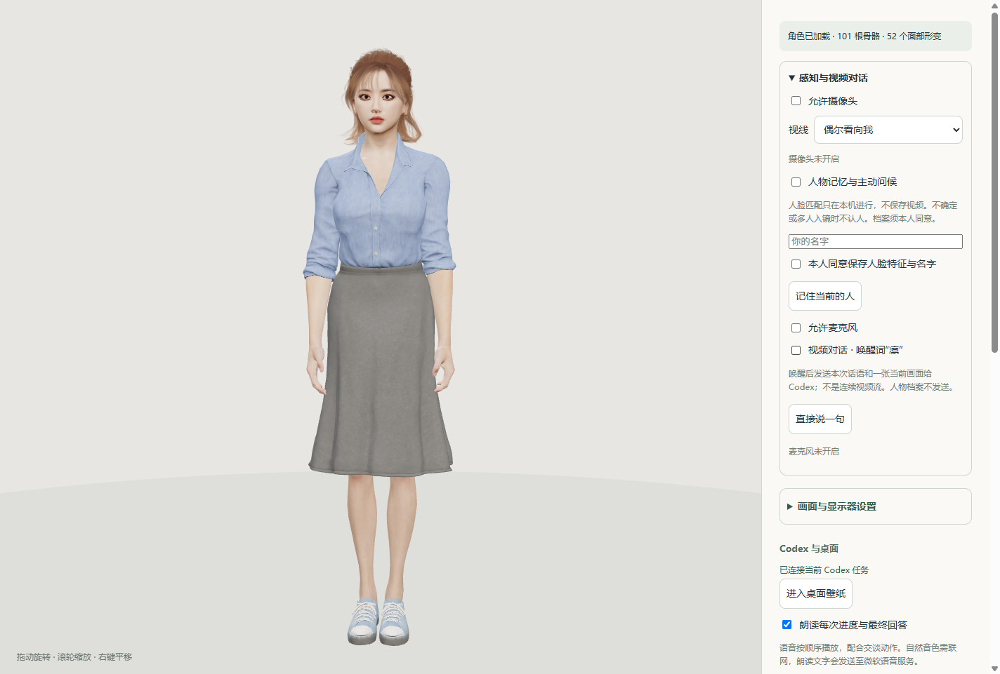

# codex-alive

A Windows 3D desktop companion connected to Codex. / 让 Codex 拥有可说话、可互动的三维桌面形象。



## 功能

- Electron + Three.js 三维角色、骨骼动画、表情和近似口型同步。
- Windows 桌面壁纸、多显示器选择、相机与灯光设置。
- 朗读当前 Codex 任务的公开进度与最终回答。
- 摄像头人脸跟随：偶尔注视或持续注视。
- 本地中文语音识别和“凛”唤醒，逐轮摄像头画面问答。
- 经本人同意登记后，本机加密保存人物特征与名字，支持删除。

这仍是原型：视频问答每轮发送一张画面，并非连续视频通话；当前 CLI 接入可能等待约两分钟。口型为近似对齐，人脸匹配与单音节唤醒也可能出错。

## 安装

需要 Windows 10/11、Node.js 22+、pnpm、Git LFS，以及安装并登录的 Codex CLI。语音功能需要 Python 3.11+。

```powershell
git lfs install
git clone https://github.com/ylty0713/codex-alive.git
cd codex-alive
git lfs pull
pnpm install
python -m pip install -r desktop/requirements.txt
pnpm start
```

如 Python 不在 PATH，设置 `$env:RIN_PYTHON = 'C:/path/to/python.exe'`。程序也能使用本机 Codex 提供的 Python 运行时。请确保依赖安装到程序所用的同一个 Python。

资源约 4.4 GB，模型、贴图、动作、Blender/Maya 源文件以及本地识别模型由 Git LFS 跟踪。请确认 `git lfs pull` 完成；普通下载 ZIP 可能只包含指针。

## 连接自己的 Codex

`desktop/companion-config.json` 是不含私人路径的默认配置。新建被 Git 忽略的 `desktop/companion-config.local.json`：

```json
{
  "executable": "C:/path/to/codex.exe",
  "watchThread": "你的任务 ID",
  "watchFile": "C:/path/to/rollout.jsonl"
}
```

`executable` 留空会尝试自动查找 Codex。面板独立聊天沿用本机 Codex 登录；公开进度朗读需要正确的 `watchFile`，也可通过 `RIN_WATCH_FILE` 环境变量指定。日志观察器是兼容适配，格式变化可能需要维护。

## 使用

`Ctrl+Alt+R` 打开面板，`Ctrl+Alt+Q` 退出。启动后摄像头和麦克风默认关闭，手动启用视频对话后说“凛”，再说问题。模型名称统一使用中性的 companion-character / character；历史源资产保留各自产品名称以便追溯。

自然语音将朗读文字发送给微软在线语音服务；视频对话将当轮话语与摄像头快照发送给 Codex。人脸档案不随视频请求发送，只有本人同意登记后才保存在本机。

## 开发与打包

```powershell
pnpm test
pnpm run check
pnpm run package
```

打包输出 `dist/Companion-v0.3.1/Rin.exe`，可通过 `启动凛.vbs` 启动。当前打包不内置 Python 解释器；发布给其他电脑时仍需安装 Python 和语音依赖。

`desktop/` 为桌面宿主、Codex 和语音桥接；`modeling/` 为当前角色渲染和感知；`src/` 保留最初的程序化角色；`assets/` 包含模型资源；`scripts/` 包含模型处理与验证工具。部分建模工具需要 Blender/Maya 和各自输入文件。

## 许可证与来源

项目原创代码采用 MIT，见 [LICENSE](LICENSE)。模型、设计图、动作、贴图和第三方依赖不自动适用代码许可证，见 [ASSET-NOTICE.md](ASSET-NOTICE.md)。项目与 OpenAI、Porter Robinson、《Shelter》及各素材作者没有官方关联。

## 界面展示

以下为 v0.3.1 实际运行截图，摄像头与麦克风处于关闭状态。

### 角色与 Codex 互动


### 面部细节



### 相机、灯光与显示器



### 感知与视频对话


